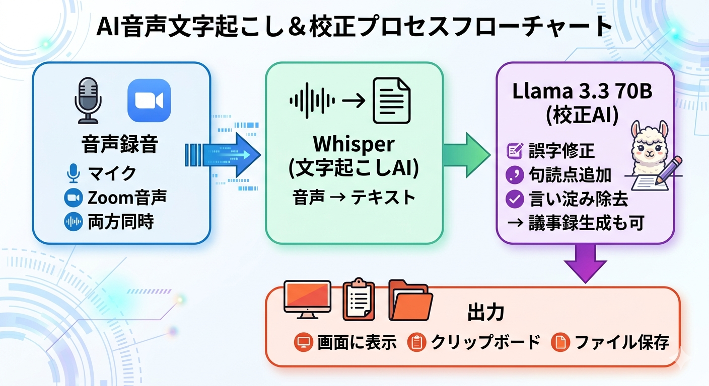

# Groq Voice Input 取扱説明書

## このツールについて

Groq Voice Input は、音声をテキストに変換し、AIが自動で校正・整形するツールです。
Zoom会議の録音から議事録の自動作成まで対応しています。

---

## 仕組み



**処理はすべてGroqのクラウドサーバーで行われます。**
パソコンには録音機能のみで、高性能なGPUは不要です。

---

## Groq APIキーの取得（必須・無料）

このツールを使うには **Groq APIキー** が必要です。
無料で取得でき、クレジットカードの登録は不要です。

### 取得手順

1. ブラウザで **https://console.groq.com/** を開く
2. **Sign Up**（新規登録）をクリック
3. Googleアカウントまたはメールアドレスで登録
4. ログイン後、左メニューの **「API Keys」** をクリック
5. **「Create API Key」** をクリック
6. 名前を入力（例：「whisper」）して作成
7. 表示されたキー（`gsk_` で始まる文字列）を **コピーして保存**

**注意：キーは作成時に1回だけ表示されます。必ずコピーしてください。**

---

## 利用料金の目安

Groqは従量課金制ですが、非常に安価です。無料枠もあります。

### 30分の会議を録音・処理した場合

| 処理 | モデル | 料金 |
|------|--------|------|
| 文字起こし | Whisper large-v3-turbo | 約 $0.02（約3円） |
| テキスト校正 | Llama 3.3 70B | 約 $0.004（約0.6円） |
| 議事録生成 | Llama 3.3 70B | 約 $0.004（約0.6円） |
| **合計** | | **約 $0.03（約4〜5円）** |

### 月間の目安

| 使い方 | 月間コスト |
|--------|-----------|
| 1日30分の音声入力 × 20日 | 約 $0.60（約90円） |
| 週1回60分の会議議事録 × 4回 | 約 $0.24（約36円） |
| 毎日1時間ヘビーに使用 × 30日 | 約 $1.80（約270円） |

**無料枠の範囲内であれば、料金は一切かかりません。**

---

## インストール手順（macOS）

### 必要なもの

- Mac（Apple Silicon / Intel どちらでもOK）
- インターネット接続
- Groq APIキー（上記で取得）

### 手順

**ターミナル** を開きます（Spotlight で「ターミナル」と検索）。

以下の3行を **1行ずつコピー＆ペースト** して実行してください：

```
git clone https://github.com/ikapulpo/whisper.git
```

```
cd whisper
```

```
bash install.sh
```

インストーラーが自動で以下を行います：
- Homebrew（Mac用パッケージマネージャー）
- portaudio（マイク録音用）
- ffmpeg（音声処理用）
- BlackHole（システム音声キャプチャ用）
- Python パッケージ

途中でAPIキーの入力を求められるので、取得したキーを貼り付けてください。

---

## 起動方法

### 方法1：ダブルクリック（かんたん）

Finderで `whisper` フォルダを開き、**`start.command`** をダブルクリック。

初回は「開発元が未確認」と表示される場合があります。その場合：
1. システム設定 → プライバシーとセキュリティ
2. 「このまま開く」をクリック

### 方法2：ターミナルから

```
cd ~/whisper
python3 groq_voice_gui.py
```

---

## 使い方

### 画面の説明

```
┌──────────────────────────────────────┐
│  モード: [マイク ▼]   [✓] 議事録生成  │  ← モード選択
├──────────────────────────────────────┤
│                                      │
│         [ 録音開始 ]                  │  ← 大きなボタン
│                                      │
├──────────────────────────────────────┤
│  ～～～波形モニター～～～   ▌▌        │  ← 音声レベル表示
├──────────────────────────────────────┤
│  状態: 待機中                 00:00   │
├──────────────────────────────────────┤
│  [生テキスト] [校正済み] [議事録]     │  ← タブ切り替え
│                                      │
│  （結果がここに表示されます）          │
│                                      │
├──────────────────────────────────────┤
│ [コピー] [保存] [フォルダを開く]      │  ← アクションボタン
└──────────────────────────────────────┘
```

### 基本操作

1. **モード** を選ぶ
   - **マイク**：自分の声を録音
   - **システム音声**：Zoomの相手の声を録音
   - **マイク+システム**：両方を同時に録音

2. **「録音開始」** ボタンをクリック（ボタンが緑→赤に変わる）

3. 波形モニターで **音声が入っていることを確認**
   - 波形が動いていればOK
   - 平らな線のまま＝音声が入っていません（設定を確認）

4. **「録音停止」** ボタンをクリック

5. 自動で処理が進みます：
   - 文字起こし → テキスト校正 → （議事録生成）

6. 結果は **自動でクリップボードにコピー** されるので、そのまま `Cmd+V` で貼り付けできます

### 議事録を作る場合

「議事録生成」にチェックを入れてから録音すると、校正後に議事録も自動生成されます。

---

## Zoom会議のシステム音声を録音する設定

Zoomの相手の声を録音するには **BlackHole** の設定が必要です。
（install.sh で BlackHole 自体はインストール済みです）

### 設定手順

1. **Audio MIDI設定** を開く
   - Spotlight で「Audio MIDI設定」と検索
   - または `/アプリケーション/ユーティリティ/Audio MIDI設定.app`

2. 左下の **「＋」** ボタン → **「複数出力装置を作成」**

3. 以下の2つに **チェック** を入れる：
   - **Macのスピーカー**（Built-in Output）
   - **BlackHole 2ch**

4. スピーカーを **「マスターデバイス」** に設定

5. **システム設定** → **サウンド** → **出力** → **「複数出力装置」** を選択

これで、スピーカーから音が聞こえつつ、BlackHole にも音声が流れます。

### 確認方法

ツールで **モード → 「システム音声」** を選んで録音開始。
波形モニターに波形が表示されれば設定完了です。

---

## 保存ファイルの場所

処理結果は `whisper/output/` フォルダに自動保存されます。

```
whisper/output/
  transcription_20260413_140523.txt   ← 校正済みテキスト
  minutes_20260413_140523.txt         ← 議事録（議事録生成時のみ）
```

GUIの **「保存フォルダを開く」** ボタンでFinderから直接開けます。

---

## トラブルシューティング

### 「APIキー未設定」と表示される

ターミナルで以下を実行してください：

```
echo 'export GROQ_API_KEY=あなたのキー' >> ~/.zshrc
source ~/.zshrc
```

### 波形が平らなまま（音声が入らない）

- **マイクモード**：システム設定 → プライバシーとセキュリティ → マイク で、ターミナルの許可を確認
- **システム音声モード**：上記の「Zoom会議のシステム音声を録音する設定」を確認。特にサウンド出力が「複数出力装置」になっているか確認

### 「BlackHole が見つかりません」

ターミナルで以下を実行：

```
brew install blackhole-2ch
```

### start.command が「開発元が未確認」で開けない

システム設定 → プライバシーとセキュリティ → 「このまま開く」をクリック

---

## まとめ

| 項目 | 内容 |
|------|------|
| 費用 | 30分あたり約4〜5円（無料枠あり） |
| 必要なもの | Mac + Groq APIキー（無料） |
| インストール | `bash install.sh` の1コマンド |
| 起動 | `start.command` をダブルクリック |
| 操作 | ボタンを押すだけ |
| 対応 | マイク入力 / Zoom音声 / 議事録生成 |
